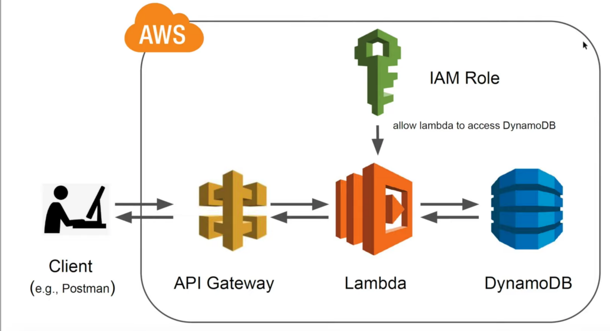

# Deploing serverless BERT NLP model using AWS Lambda, HuggingFace, and Docker
## What is AWS lambda?
AWS Lambda is a serverless computing service in that we can run code without worrying about provisioning or managing servers. You only pay for what you use, and you are not charged anything if your application is not being used. It was originally developed to run computationally less expensive workloads, but now it can also be used for larger applications. 

## What is new with AWS Lambda?
Since December 2020, it has been possible now package and deploy Lambda functions as container images of up to 10
GB in storage size and six vCPUS. This means that large machine learning models can be deployed using a serverless
approach that can be called in parallel to AWS lambda.
In this repository, we deploy a BERT Question-Answering API in a serverless AWS Lambda environment.
Therefore we use the Transformers library by HuggingFace, the Serverless Framework, AWS Lambda, and Amazon ECR.

## Project architecture
The project's backend is serverless and uses the AWS lambda, DynamoDB, API gateway, and ECR for container registry.
The Lambda function is the inference server wrapped in a docker image and uploaded to the AWS ECR. AWS API gateway
 sends POST request payloads to the lambda function. AWS DynamoDB is used to store the data sent to the inference
 server for monitory purposes. Lambda can talk to DynamoDB using an IAM role that only allows writing requests to the
 database.

