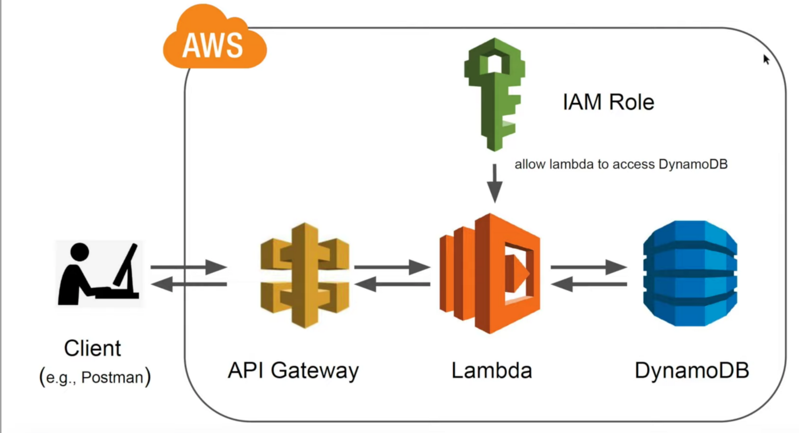

# Deploing serverless BERT NLP model using AWS Lambda, HuggingFace, and Docker
## What is AWS lambda?
AWS Lambda is a serverless computing service in that  can run code without worrying about provisioning or
managing servers. You only pay for what you use, and you are not charged anything if your application is not being
used. It was originally developed to run computationally less expensive workloads, but now it can also be
used for larger applications. It can scale pretty well and supports up to thousands of concurrent requests.
 A simple hello world lambda application looks as follows:

```python
import json

def lambda_handler(event, context):
    # TODO logic of the function
    return {
        'statusCode': 200,
        'body': json.dumps('Hello from Lambda!')
    }
```
This functions gets input data (in this example, no input is passed to the function), and returns a status code 200
 with 'Hello from Lambda' message. The lambda function can be invoked by many AWS services. If we want to access it from
 the internet, we need API gateway to create an API in front of our function.
### What is new with AWS Lambda?
Since December 2020, it has been possible now package and deploy Lambda functions as container images of up to 10
GB in storage size and six vCPUS. This means that large machine learning models can be deployed using a serverless
approach that can be called in parallel to AWS lambda.
In this repository, we deploy a BERT Question-Answering API in a serverless AWS Lambda environment.
Therefore we use the Transformers library by HuggingFace, the Serverless Framework, AWS Lambda, and Amazon ECR.

## What is AWS API gateway?


## Project architecture
The project's backend is serverless and uses the AWS lambda, DynamoDB, API gateway, and ECR for container registry.
The Lambda function is the inference server wrapped in a docker image and uploaded to the AWS ECR. AWS API gateway
 sends POST request payloads to the lambda function. AWS DynamoDB is used to store the data sent to the inference
 server for monitory purposes. Lambda can talk to DynamoDB using an IAM role that only allows writing requests to the
 database.



## How to use
The Infrausturcture is deployed using [serverless](https://www.serverless.com/framework/docs) library.
Install serverless using npm if you don't have it already.
```shell script
npm install -g serverless
```
If you want to start a project from zero, there are
some templates that can be used by running serverless in the terminal and following the prompts. Here is an example of
the serverless configuration file to deploy a Lambda function with API gateway:
```yaml
service: serverless-bert-lambda-docker

provider:
  name: aws # provider
  region: us-east-1 # aws region
  memorySize: 5120 # optional, in MB, default is 1024
  timeout: 30 # optional, in seconds, default is 6
functions:
  questionanswering:
    image: ${ACOUNT_NUMBER}.dkr.ecr.us-east-1.amazonaws.com/bert-lambda:v1 #ecr url
    events:
      - http:
          path: qa # http path
          method: post # http method
```
The complete serverless.yaml file that includes DynamoDB integration is written in this [file](serverless-bert/serverless.yaml).
To deploy the archetecture, jus write the following in the same directory as the [serverless.yaml](serverless-bert/serverless.yaml) file.

```shell script
serverless deploy
```
