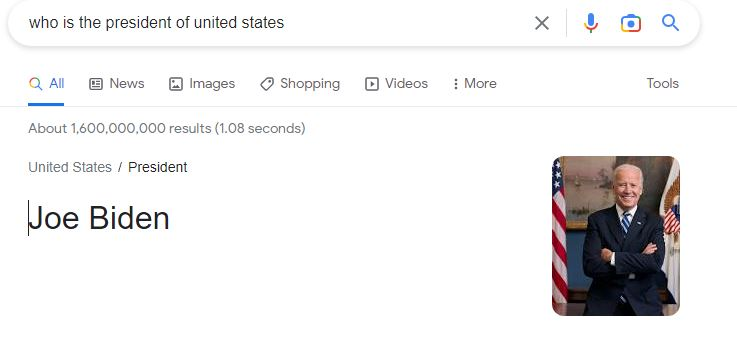
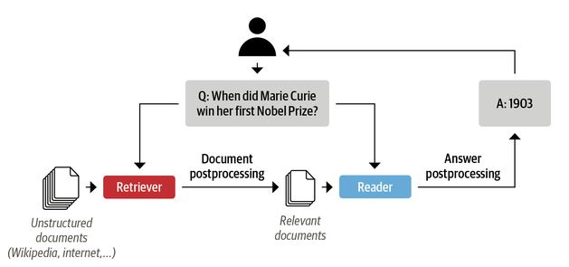
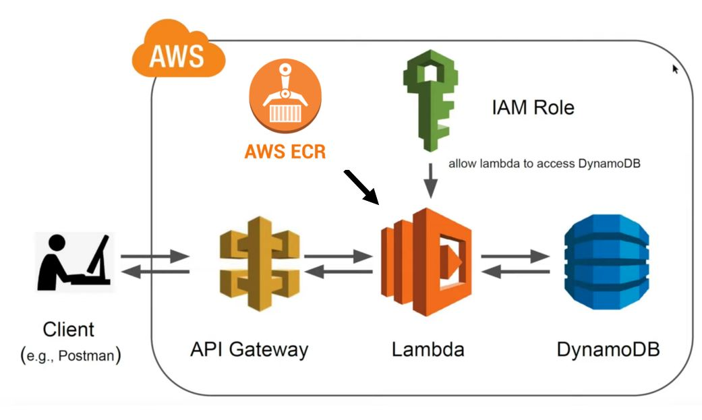

# Question Answering NLP Applications
## What is a Question and AnsWering NLP
Have you ever wondered what happens when you ask a question on Google and immediately get an answer?
For example, we ask `who is the president of the united states on the google search bar, and we get this answer:



We can see that Google first searched and ranked 1.6 billion pages in 1.08 seconds and then performed an additional processing step
to find the answer snippet from the page. The first task is the core product of Google as a search engine. The second
processing technique (finding the answer to a question from a webpage) is the question and answering (QA) problem.
Modern QA systems are semantic search engines, intelligent assistants, and automated information extractors.

In the QA problems, a question and a context are passed to the model, returning the answer to the question in the context. This approach can be
used to build an enterprise-level QA system. For example, a document search engine, such as Elastic Search, can be used to
rank the documents, and a QA model to find the answer within the document. The Haystack library developed by Deepset,
a German company focused on NLP can be used to build document ranking and answer questions within the document.
Here is an example of a reader-retriever architecture for question-answering systems.



In this document, we only focus on the QA answering part of the system, where we have a context and a question and want the answer.

### Model building
We use the squad_v2 data set to fine-tune a pre-trained transformer model from the Hugging Face model hub. Squad_v2
combines the 100,000 questions in SQuAD1.1 with over 50,000 unanswerable questions written adversarially by
crowd workers to look similar to answerable ones. The systems answer questions
when possible and determine when the paragraph supports no answer and abstains from answering. We will use
MobileBert, which is the compressed version of the popular BERT model. On the SQuAD v1.1/v2.0 question answering task,
MobileBERT achieves a dev F1 score of 90.0/79.2 (1.5/2.1 higher than BERT_BASE) [1](https://arxiv.org/abs/2004.02984).

We will bring the pre-trained model and tokenizer from the hugging face library. This python snipped, downloads the mibilbert
model fine-tuned on Squad_v2 dataset into the `./model` directory.

```python
from transformers import AutoModelForQuestionAnswering, AutoTokenizer

def get_model(model):
    """Loads model from Hugginface model hub into
    the ./model directory"""

    try:
        model = AutoModelForQuestionAnswering.from_pretrained(model, use_cdn=True)
        model.save_pretrained("./model")
    except Exception as e:
        raise (e)
get_model("mrm8488/mobilebert-uncased-finetuned-squadv2")
```

This python snniped, downloads the mibilbert tokenizer into the `./model` directory.

```python
def get_tokenizer(tokenizer):
    """Loads tokenizer from Hugginface model hub into
    the ./model directory"""

    try:
        tokenizer = AutoTokenizer.from_pretrained(tokenizer)
        tokenizer.save_pretrained("./model")
    except Exception as e:
        raise (e)

get_tokenizer("mrm8488/mobilebert-uncased-finetuned-squadv2")
```

Once we have the tokenizer, we will be able to encode the data that goes to the models and also decode the response from
the model. This is the code snipped for the encoder function that takes the question, context, and tokenizer and returns
`attention_masks` and the `inpud_ids` that will be passed to the model.

```python
def encode(tokenizer, question, context):
    """encodes the question and context with a given tokenizer
    that is understandable to the model"""
    encoded = tokenizer.encode_plus(question, context)
    return encoded["input_ids"], encoded["attention_mask"]
```
This code snipped will take the model's answer and decode it to a human-readable string format.

```python
def decode(tokenizer, token):
    """decodes the tokens to the answer with a given tokenizer
    to return human readable response in a string format"""
    answer_tokens = tokenizer.convert_ids_to_tokens(token, skip_special_tokens=True)
    return tokenizer.convert_tokens_to_string(answer_tokens)
```
We need to combine the encoder, model prediction, and decoder in a method. The following code snipped first loads the
model and the tokenizer from the `./model` directory. First, the question and context are passed through the encoder method,
the output is passed through the model, and finally, the answer tokens are passed through the decode method to get
the answer in a string format.

```python
from transformers import AutoModelForQuestionAnswering, AutoTokenizer, AutoConfig
import torch

def serverless_pipeline(model_path="./model"):
    """Initializes the model and tokenzier and returns a predict
        function that ca be used as pipeline"""
    tokenizer = AutoTokenizer.from_pretrained(model_path)
    model = AutoModelForQuestionAnswering.from_pretrained(model_path)

    def predict(question, context):
        """predicts the answer on an given question and context.
        Uses encode and decode method from above"""
        input_ids, attention_mask = encode(tokenizer, question, context)
        start_scores, end_scores = model(
            torch.tensor([input_ids]), attention_mask=torch.tensor([attention_mask])
        )
        ans_tokens = input_ids[
            torch.argmax(start_scores) : torch.argmax(end_scores) + 1
        ]
        answer = decode(tokenizer, ans_tokens)
        return answer

    return predict
```

### Storing the logs in DynamoDB
DynamoDB is a fully managed, serverless, NoSQL database that is perfect for storing the model's inputs and outputs for monitoring and evaluating the model. We use the boto3 library to put the logs in our database. We keep the name of our
DynamoDB in our Lambda's environment variable under `DYNAMO_TABLE`. We want to store the time, payload context and question, and the answer to the database. This code snipped shows how we keep the data in DyanmoDB after we know the answer to
the question.

```python
import boto3
import os
import uuid
import time

dynamodb = boto3.resource("dynamodb", region_name="us-east-1")
table = dynamodb.Table(os.environ["DYNAMODB_TABLE"])

timestamp = str(time.time())
item = {
    "primary_key": str(uuid.uuid1()),
    "createdAt": timestamp,
    "context": body["context"],
    "question": body["question"],
    "answer": answer,
}
table.put_item(Item=item)
```

### Lambda function
Lambda is the serverless computing service from AWS, where the inference will be served. A Lambda handler is where
the information from an API request passes through the function and returns the output to the API. We will include the
DynamoDB writes code within the function as well.

```python
def handler(event, context):
    try:
        # loads the incoming event into a dictonary
        body = json.loads(event["body"])
        # uses the pipeline to predict the answer
        answer = question_answering_pipeline(
            question=body["question"], context=body["context"]
        )
        timestamp = str(time.time())
        item = {
            "primary_key": str(uuid.uuid1()),
            "createdAt": timestamp,
            "context": body["context"],
            "question": body["question"],
            "answer": answer,
        }
        table.put_item(Item=item)
        return {
            "statusCode": 200,
            "headers": {
                "Content-Type": "application/json",
                "Access-Control-Allow-Origin": "*",
                "Access-Control-Allow-Credentials": True,
            },
            "body": json.dumps({"answer": answer}),
        }
    except Exception as e:
        print(repr(e))
        return {
            "statusCode": 500,
            "headers": {
                "Content-Type": "application/json",
                "Access-Control-Allow-Origin": "*",
                "Access-Control-Allow-Credentials": True,
            },
            "body": json.dumps({"error": repr(e)}),
        }
```
You can see all the code in [handler.py](https://github.com/RustamyF/lambda-bert-huggingface/blob/git-workflow/serverless-bert/handler.py) file.

### Dockerize everything
Since Lambda functions now support docker images, we can dockerize everything and upload it to the Amazon Elastic
Container Registry (Amazon ECR) repository. The Lambda function will access this image to make predictions. The Dockerfile uses
AWS's published base image for Lambda functions.

```shell
FROM public.ecr.aws/lambda/python:3.8

# Copy function code and models into our /var/task
COPY ./ ${LAMBDA_TASK_ROOT}/

# install our dependencies
RUN python3 -m pip install -r requirements.txt --target ${LAMBDA_TASK_ROOT}

# run get_model.py to get model weights and tokenizers
RUN python3 get_model.py

# Set the CMD to your handler (could also be done as a parameter override outside of the Dockerfile)
CMD [ "handler.handler" ]
```

We need to send to build, tag and push the docker image to the ECR repository. First, we need to login to our ECR repository
using aws CLI.

```shell
aws_region=<your aws region>
aws_account_id=<your aws account>

aws ecr get-login-password --region $aws_region \
| docker login username AWS --password-stdin $aws_account_id.dkr.ecr.$aws_region.amazonaws.com
```

Then build, tag and push the docker image to the ECR repository.

```shell
docker build -t nlp-lambda:v1 serverless-bert/.
docker tag nlp-lambda:v1 $aws_account_id.dkr.ecr.$aws_region.amazonaws.com/nlp-lambda:v1
docker push $aws_account_id.dkr.ecr.$aws_region.amazonaws.com/nlp-lambda:v1
```
## Serverless
Question and Answering System



