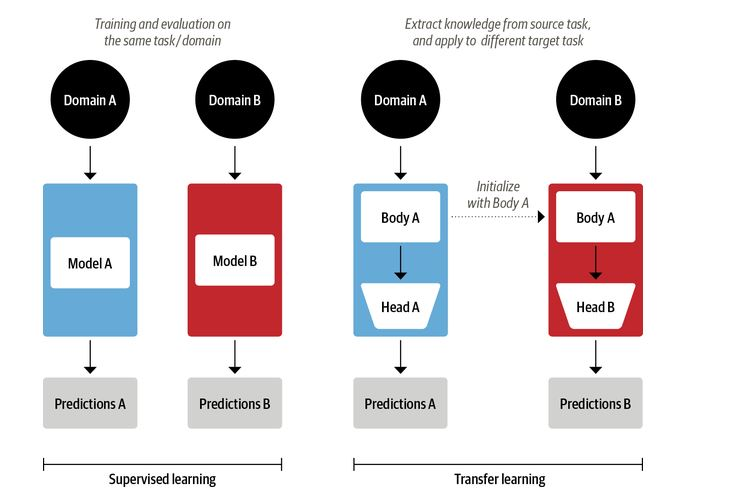
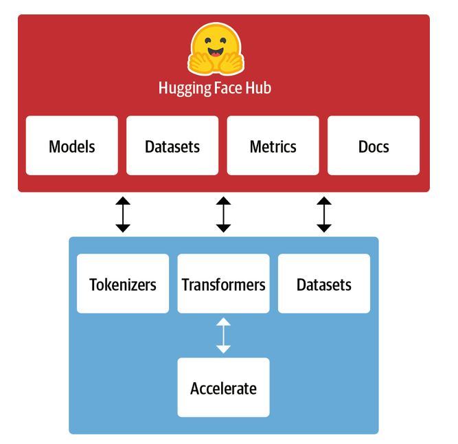

# NLP with Transformers
Modern natural language processing (NLP) applications are typically built using transformer architectures proposed by
Google researchers in 2017. [1](https://arxiv.org/abs/1706.03762) These architectures outperformed recurrent neural networks (RNN) and long short-term memory
(LSTM) networks and also made transfer learning possible in the field of NLP. Two of the mosel popular transformer architectures
that powers most of the NLP applications are the Generative Pretrained Transformer (GPT)[2](https://openai.com/blog/language-unsupervised/)
and Bidirectional Encoder Representations from Transformers (BERT).[3](https://arxiv.org/abs/1810.04805)

## Transfer Learning in NLP
Transformers also made transfer learning possible in the field of NLP. Transfer learning is a very common practice in computer vision, where convolutional neural networks are trained on one
task and then fine-tuned and adopted on a new task. Architecturally, this involves splitting the model into body and a head, where the head is a task-specific network.
 During training, the weights of the body learn broad features from large scale datasets such as ImageNet, and these weights are used to
 initialize a new model for the new task. This approach became a standard approach in computer vision.
 Most computer vision models in production are trained using transfer learning techniques.

 

 After the transformers architecture enabled the transformer learning in NLP, numerous institutions released their trained NLP models
 to be be used by the academics and practitioners. GPT and BERT are the two pre-trained models that sat a new state of the art across a
  variety of NLP benchmarks and ushered in the age of transformers. Overtime, different research institutions released different
  variation of the transformer architectures, some using PyTorch and other using Tensorflow, which made it hard for practitioners to
  use these models. HuggingFace created a set of unified APIs and a collection of pre-trained models and datasets that simplified
  the adoption of the state-of-teh art NLP models for the practitioners.

## HugginFace Library for NLP
The HuggingFace Transformers provide a standardized interface to a wide range of transformer models as well as code and
tools to adapt these models to new use cases. It also supports the three major deep learning frameworks: Pytorch, Tensorflow and
JAX. The HuggingFace ecosystem consists of mainly two parts: a family of libraries and the Hub, as shown below. The libraries
 provide the code while the Hub provides the pretrained model weights, datasets, scripts for the evaluation metrics, and more.

  
