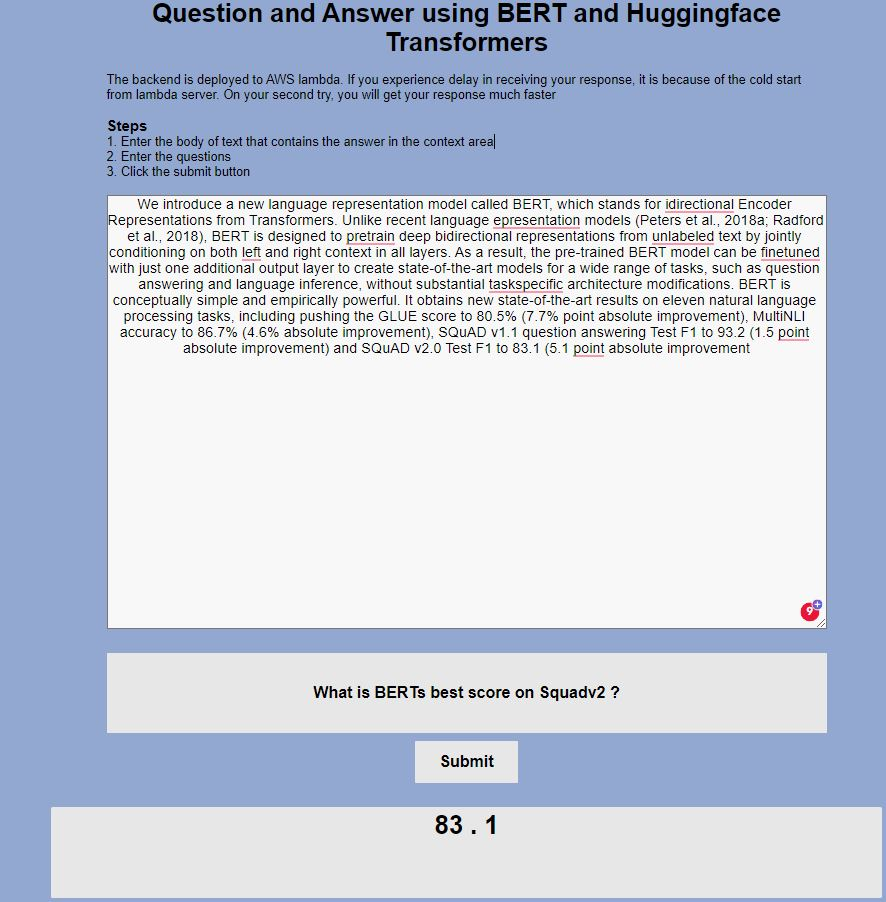

# Question Answering NLP Applications
## What is a Question and AnsWering NLP
Question-answering NLP models are often used in applications such as search engines, customer service chatbots,
and virtual assistants. This [blog](https://medium.com/@faheemrustamy/serverless-question-answering-nlp-1e27fa83b04) post
described the QA NLP problem and built and deployed a full stack serverless
QA NLP application using the HuggingFace library and AWS infrastructure. A Serverless ML application may not be a
 good deployment approach for all use cases, but it is a great first step to you put your models in production without
  worrying about the underlying infrastructure.

## Build Docker Image
We need to send to build, tag and push the docker image to the ECR repository. First, we need to login to our ECR repository
using aws CLI.

```shell
aws_region=<your aws region>
aws_account_id=<your aws account>

aws ecr get-login-password --region $aws_region \
| docker login username AWS --password-stdin $aws_account_id.dkr.ecr.$aws_region.amazonaws.com
```

Then build, tag and push the docker image to the ECR repository.

```shell
docker build -t nlp-lambda:v1 ..
docker tag nlp-lambda:v1 $aws_account_id.dkr.ecr.$aws_region.amazonaws.com/nlp-lambda:v1
docker push $aws_account_id.dkr.ecr.$aws_region.amazonaws.com/nlp-lambda:v1
```
## Deploy a Serverless Application
We will use the Serverless library, an open-source and cloud-agnostic library that works for all major public cloud
providers. Install serverless using npm if you don’t have it installed on your machine already. If you don’t have npm
 on your machine, follow the installation instructions here.

```shell script
npm install -g serverless
```

The serverless framework needs AWS credentials to access AWS resources on our behalf. Follow this instruction to
create an IAM user if you don’t have any, and use that to set up your credentials. It is recommended to use AWS-CLI
 to configure AWS credentials. To set them up through the aws-cli , install it first, then run aws configure to
 configure the AWS-CLI and credentials:
```shell script
$ aws configure
AWS Access Key ID [None]:
AWS Secret Access Key [None]:
Default region name [None]:
Default output format [None]:
```

Once everything is ready, the following command will use the serverless config file and deploy the infrastructure to
 AWS. Make sure you are in the same directory as the config file.

```shell script
serverless deploy
```


Once the deployment is completed, serverless will return URL of the API Gateway that can be used to test the model.
You can use Postman, javascript, or curl to invoke the model. In the GitHub repo of this project, a simple frontend
application using HTML, CSS, and javascript is created to interact with the deployed API Gateway.


